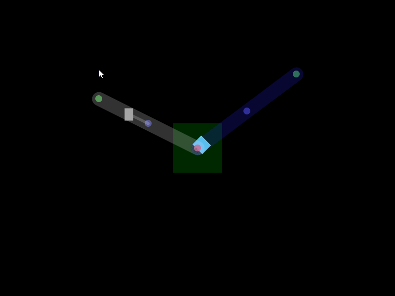

# Game_ResourceFactory

Tiny factory-builder style game I made in Processing (Java) 100 years ago.

# Features

- Structures
  - `Mine`: Produces Resources
  - `Container`: Stores Resources
  - `TransportLink`: Transports Resources between Containers
- Resources
  - Iron
  - Gold
  - Diamond

# Todo

- Controls

  - Structure placement
  - Structure removal

- Structures

  - `Machine`: Combines Resources into new Resources.

- A system where structures has a cost to be placed.
